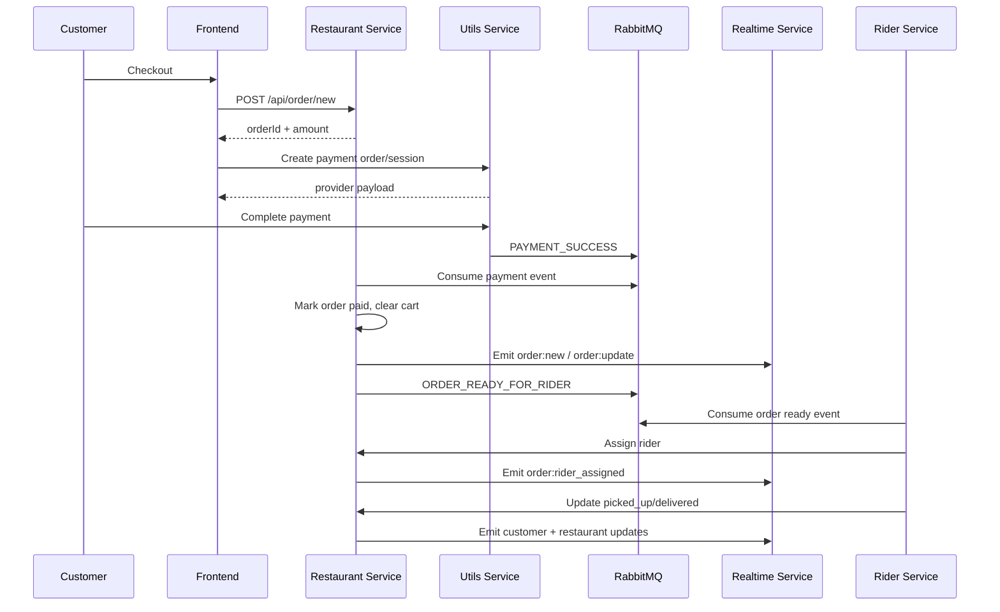

# BhookBuster System Design

## 1. High-Level Architecture

BhookBuster is a microservices-based food delivery platform with separate services for authentication, ordering, rider operations, admin analytics, realtime communication, and utility integrations.

```mermaid
flowchart LR
  FE["Frontend (React)"] --> AUTH["Auth Service"]
  FE --> REST["Restaurant Service"]
  FE --> RIDER["Rider Service"]
  FE --> ADMIN["Admin Service"]
  FE --> UTIL["Utils Service"]
  FE <--> RT["Realtime Service (Socket.IO)"]

  AUTH --> MDB[(("MongoDB"))]
  REST --> MDB
  RIDER --> MDB
  ADMIN --> MDB

  REST <--> REDIS[(("Redis"))]
  RIDER <--> REDIS
  ADMIN <--> REDIS

  UTIL --> PAY["Razorpay / Stripe"]
  UTIL --> MQ[(("RabbitMQ"))]
  REST --> MQ
  RIDER --> MQ
```

The frontend talks directly to the service responsible for the domain. The system avoids a monolith by keeping service responsibilities narrow and using RabbitMQ plus internal HTTP calls for cross-service workflows.

## 2. Service Breakdown

### Auth Service

- Handles Google OAuth login
- Issues and verifies JWTs
- Supports role assignment
- Returns authenticated profile data to the client

### Restaurant Service

- Owns restaurant, menu, cart, address, and order data
- Creates orders before payment
- Marks orders paid after consuming payment events
- Drives seller-side order progression
- Publishes rider-ready events
- Exposes seller analytics

### Rider Service

- Owns rider onboarding and availability
- Consumes rider-ready events
- Finds nearby eligible riders
- Lets riders accept work and progress deliveries
- Exposes rider earnings analytics

### Admin Service

- Handles restaurant and rider verification queues
- Computes platform-wide analytics
- Uses Redis to reduce repeated aggregation load

### Realtime Service

- Accepts authenticated Socket.IO connections
- Joins users to role-specific rooms
- Exposes an internal `/emit` endpoint for backend services

### Utils Service

- Integrates with Razorpay and Stripe
- Publishes `PAYMENT_SUCCESS` events after verification
- Supports file uploads used by restaurant/rider profile flows

## 3. Data Flow

### Order Lifecycle



### Payment Flow

1. Restaurant service creates a pending order with price snapshot, fees, expiry, and address data.
2. Frontend calls utils service for Razorpay order creation or Stripe checkout session creation.
3. After provider verification, utils service publishes `PAYMENT_SUCCESS`.
4. Restaurant service consumes the event, sets `paymentStatus = paid`, removes the TTL expiry, clears the customer cart, and emits realtime order creation.

### Rider Assignment Flow

1. Seller progresses the order to `ready_for_rider`.
2. Restaurant service publishes `ORDER_READY_FOR_RIDER`.
3. Rider service queries nearby verified and online riders using geospatial location.
4. Rider service updates rider queue cache and emits `order:available` to each eligible rider room.
5. The first rider who accepts triggers an internal assignment request.
6. Restaurant service uses conditional update logic to avoid double assignment.

## 4. Redis Caching Strategy

BhookBuster uses cache-aside rather than write-through caching.

### Cached Areas

- Admin stats, trends, top items, verification queues
- Nearby restaurant discovery and menu listing
- Restaurant BI analytics
- Rider profile, rider queue, rider current order

### Why Cache Here

- these endpoints are read-heavy
- several of them depend on aggregation or multi-step lookups
- cache hit latency is materially better than repeated MongoDB aggregation or cross-service reads

### TTLs

- `stats`: 60 seconds
- `lists`: 5 minutes
- `trends`: 5 minutes

### Trade-Offs

- Pros:
  - simple to reason about
  - resilient when Redis is down
  - low implementation risk for a late-stage production pass
- Cons:
  - some views can be briefly stale
  - invalidation is only partial on mutations
  - analytics freshness is eventually consistent rather than immediate

## 5. RabbitMQ Event Flow

### `PAYMENT_SUCCESS`

- Producer: utils service
- Consumer: restaurant service
- Outcome:
  - mark order paid
  - remove expiry TTL
  - clear cart
  - emit realtime order creation

### `ORDER_READY_FOR_RIDER`

- Producer: restaurant service
- Consumer: rider service
- Outcome:
  - find candidate riders
  - update rider queue cache
  - emit rider availability events

Why RabbitMQ instead of synchronous calls:

- payment confirmation and rider discovery are asynchronous workflows
- consumer unavailability should not block user-facing provider verification
- buffering events gives better fault isolation than chaining direct HTTP calls end-to-end

## 6. Realtime Communication

Socket.IO is used for state that improves UX when pushed immediately:

- new order arrival for restaurants
- order status updates for customers
- rider assignment for customers and restaurants
- rider queue notifications
- rider live location during delivery

Room model:

- `user:{userId}`
- `restaurant:{restaurantId}`

This design keeps fan-out targeted and avoids broadcasting irrelevant events system-wide.

## 7. Scalability Considerations

### Horizontal Scaling

- services are stateless at the HTTP layer and can scale independently
- Socket.IO would need sticky sessions or an adapter such as Redis pub/sub in multi-instance deployment
- MongoDB and RabbitMQ are already externalized dependencies, which supports multi-instance app deployment

### Database Scaling

- restaurant discovery depends on geo indexes
- analytics-heavy admin endpoints will eventually benefit from pre-aggregated read models
- order history can be archived by time if the dataset grows significantly

### Caching and Read Scaling

- cache hot paths are already identified
- seller/admin dashboards are good candidates for more aggressive materialized summaries
- rider queue and nearby restaurant reads can benefit from stronger invalidation or event-driven warmup later

## 8. Trade-Offs

### Microservices vs Monolith

Why microservices were a good fit here:

- each role has distinct workflows
- payment, realtime, analytics, and dispatch have different scaling and failure characteristics
- the architecture demonstrates service-boundary thinking clearly

What it costs:

- more deployment complexity
- more operational overhead
- harder local orchestration
- eventual consistency becomes part of the design

### Caching Trade-Offs

- Redis reduces repeated load and improves dashboard responsiveness
- stale reads are acceptable for dashboards and rider queue hints
- critical writes still go straight to MongoDB

## 9. Failure Handling

### If Redis Goes Down

- services fall back to direct MongoDB or internal HTTP reads
- read latency increases, but correctness remains intact
- this is a deliberate availability-over-performance choice

### If RabbitMQ Fails

- payment-confirmed orders may not transition to paid until the queue recovers
- rider-ready notifications may be delayed
- user-facing synchronous APIs still work for non-event-dependent flows

Recommended next step:

- add retries, dead-letter queues, and monitoring on queue depth/consumer lag

### If a Service Goes Down

- auth down: login/profile verification fails
- restaurant down: ordering and seller flows fail
- rider down: dispatch and delivery progression fail
- realtime down: REST flows still work, but live UX degrades to polling-only behavior
- utils down: uploads and payment session creation fail

## 10. Interview Summary

> BhookBuster is a microservices-based food delivery platform where the restaurant service owns core order state, the utils service handles payment-provider integration, the rider service manages dispatch and delivery operations, the admin service serves cache-backed platform analytics, and the realtime service pushes room-based delivery updates. Redis reduces repeated read cost, RabbitMQ decouples async workflows like payment confirmation and rider assignment, and MongoDB remains the source of truth for transactional state.
