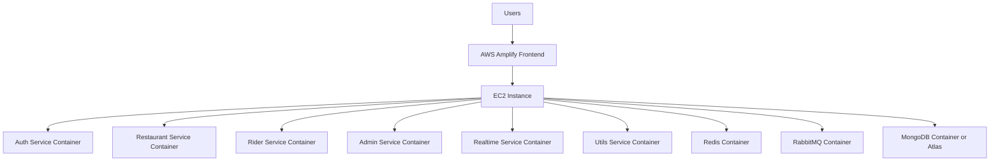

# AWS Free Deployment Guide

This guide is intentionally honest.

## Current Status (April 11, 2026)

- Verified build readiness for frontend, restaurant, admin, and rider services
- Redis cache-aside and TTL policy active across admin/restaurant/rider
- Seller and admin dashboards include settlement analytics metrics
- Rider accept flow and seller menu availability flow have recent stability fixes
- Rider dispatch path includes queue-consumer hardening and internal service URL fallback handling

## Important Reality Check

BhookBuster is a multi-service application. A fully managed AWS deployment using services like ECS, ElastiCache, Amazon MQ, and managed databases is usually **not permanently free**.

The cheapest interview/demo-friendly AWS path is:
- host the frontend on Amplify
- host the backend on a single EC2 instance
- run backend services and supporting infra in Docker on that EC2 instance

This is the most practical "free or near-free" AWS approach for a project/demo.

## 1. What "Free" Means On AWS Now

For new AWS accounts created after July 15, 2025:
- AWS offers a Free plan for up to `6 months`
- new accounts receive `USD $100` in credits and can earn up to another `USD $100` in credits

For EC2:
- AWS documentation says Free Tier includes `750 hours/month` of select EC2 instances for free for eligible accounts created before July 15, 2025
- newer accounts use the Free plan/credit model instead

For Amplify:
- free tier includes frontend hosting limits such as build minutes, storage, and transfer allowances for eligible accounts

Important cost note:
- App Runner is not an always-free hosting service
- fully managed Redis, MQ, and multi-service containers can consume credits quickly

## 2. Recommended Cheapest AWS Demo Architecture

### Option A: Best "free-ish" path

- Frontend: AWS Amplify
- Backend services: one EC2 instance with Docker Compose
- MongoDB: either Docker on the same EC2 or external free MongoDB Atlas
- Redis: Docker on the same EC2
- RabbitMQ: Docker on the same EC2

Why this is best:
- simplest to explain in interviews
- cheapest AWS path for a working demo
- avoids paying separately for ECS, ElastiCache, and Amazon MQ

### Option B: More production-like, but not really free

- Frontend: Amplify
- Backend services: ECS/Fargate or App Runner
- Redis: ElastiCache
- RabbitMQ: Amazon MQ
- MongoDB: Atlas or managed DB

Use this only if you are okay spending credits or real money.

## 3. Architecture Flow



## 4. Step-By-Step AWS Deployment

### Step 1: Create AWS Account Carefully

1. Create a new AWS account.
2. Choose the Free plan if available.
3. Immediately set a billing budget and alerts.

Recommended:
- create a monthly budget of `$5`
- create billing alarms at `$1`, `$3`, and `$5`

## Step 2: Deploy Frontend To Amplify

Amplify is the easiest frontend hosting option for this project.

Steps:
1. Push your code to GitHub.
2. In AWS Amplify, choose `New app`.
3. Connect the GitHub repo.
4. Set the frontend root to `frontend`.
5. Add frontend environment variables:

```env
VITE_AUTH_SERVICE_URL=http://YOUR_EC2_PUBLIC_IP:5000
VITE_RESTAURANT_SERVICE_URL=http://YOUR_EC2_PUBLIC_IP:3000
VITE_UTILS_SERVICE_URL=http://YOUR_EC2_PUBLIC_IP:7000
VITE_REALTIME_SERVICE_URL=http://YOUR_EC2_PUBLIC_IP:4000
VITE_RIDER_SERVICE_URL=http://YOUR_EC2_PUBLIC_IP:5001
VITE_ADMIN_SERVICE_URL=http://YOUR_EC2_PUBLIC_IP:2000
```

6. Deploy.

If you later add HTTPS and a reverse proxy, replace raw ports with domain-based URLs.

## Step 3: Launch EC2

Launch:
- Amazon Linux 2023 or Ubuntu
- choose a Free Tier eligible instance if your account supports it
- otherwise choose the smallest instance that works within your credits

Suggested security group inbound rules for a demo:
- `22` for SSH from your IP only
- `3000` restaurant service
- `2000` admin service
- `5000` auth service
- `5001` rider service
- `4000` realtime service
- `7000` utils service
- optionally `80` and `443` if you add Nginx reverse proxy

For a quick interview demo, exposing ports directly is acceptable.

## Step 4: Install Docker On EC2

Example for Amazon Linux:

```bash
sudo dnf update -y
sudo dnf install docker -y
sudo systemctl enable docker
sudo systemctl start docker
sudo usermod -aG docker ec2-user
newgrp docker
```

Install Docker Compose plugin if needed.

## Step 5: Copy The Repo To EC2

Either:
- `git clone` the repo on the instance
- or upload a zip

Then create backend `.env` files for each service.

## Step 6: Choose Your Data Strategy

### Cheapest

Run these on EC2 too:
- MongoDB
- Redis
- RabbitMQ

This minimizes AWS service count and cost.

### Easier But Mixed-Cloud

Use:
- MongoDB Atlas free tier
- Redis in Docker on EC2
- RabbitMQ in Docker on EC2

This is often easier for projects and still fine for interviews if you explain the tradeoff.

## Step 7: Run Containers

For the current repo, you will likely want a broader compose file than `docker-compose.aws.yml`, because the app also depends on auth, realtime, utils, and supporting infra for a fuller demo.

Minimal interview demo path:
- frontend on Amplify
- auth, admin, restaurant, rider, realtime, utils on EC2
- Redis, RabbitMQ, MongoDB on EC2

Example manual run idea:

```bash
docker compose up -d --build
```

If your compose file does not yet include every service, add them before the final deploy.

## Step 8: Verify Backend From Your Laptop

Test ports:

```bash
curl http://YOUR_EC2_PUBLIC_IP:3000
curl http://YOUR_EC2_PUBLIC_IP:2000
curl http://YOUR_EC2_PUBLIC_IP:5001
curl http://YOUR_EC2_PUBLIC_IP:5000
```

If root routes are not implemented, test your known API endpoints.

## Step 9: Verify Frontend

After Amplify deploys:
- open the Amplify URL
- confirm homepage loads
- confirm service URLs point to EC2
- log in and test at least one user flow

## 5. Cheapest Deployment Strategy For Interviews

If your goal is only:
- a link to show recruiters
- an interview demo
- proof that it runs in AWS

Do this:
- Deploy frontend to Amplify
- Deploy backend plus Redis/RabbitMQ/MongoDB on one EC2
- Keep the instance stopped when not in use if your plan/credits require it

This is much more practical than using ECS + ElastiCache + Amazon MQ for a student/demo project.

## 6. What To Say In Interviews

Good wording:

> For cost reasons, I chose a demo-friendly AWS deployment instead of a fully managed production architecture. I kept the frontend on Amplify and consolidated backend services plus supporting infrastructure on a single EC2 instance. If I were optimizing for production rather than cost, I would move toward managed messaging, managed caching, and container orchestration.

That answer shows engineering maturity.

## 7. What Not To Claim

Do not say:
- "The whole system runs for free on AWS forever."
- "Managed AWS microservices are free."

Say:
- "I chose the cheapest AWS deployment path that was realistic for a portfolio/demo."
- "I used the AWS Free plan/credits and minimized always-on managed services."

## 8. Local-First Before AWS

Before deploying, verify locally:
- frontend build passes
- restaurant build passes
- admin build passes
- rider build passes

Use [docs/LOCAL_TESTING.md](docs/LOCAL_TESTING.md) first, then deploy.

## 9. Recommended Next Improvements

- add one production-grade Docker Compose file that includes all required services
- add Nginx reverse proxy on EC2 so frontend points to one base domain instead of raw ports
- add HTTPS via Load Balancer or reverse proxy
- add health checks for each backend service
- add CloudWatch or structured logging if you want a stronger production story

## 10. Official AWS References

These AWS details change over time, so re-check before deploying:
- AWS Free Tier overview
- EC2 Free Tier eligibility
- Amplify pricing
- ElastiCache pricing/free tier
- Amazon MQ pricing/free tier

