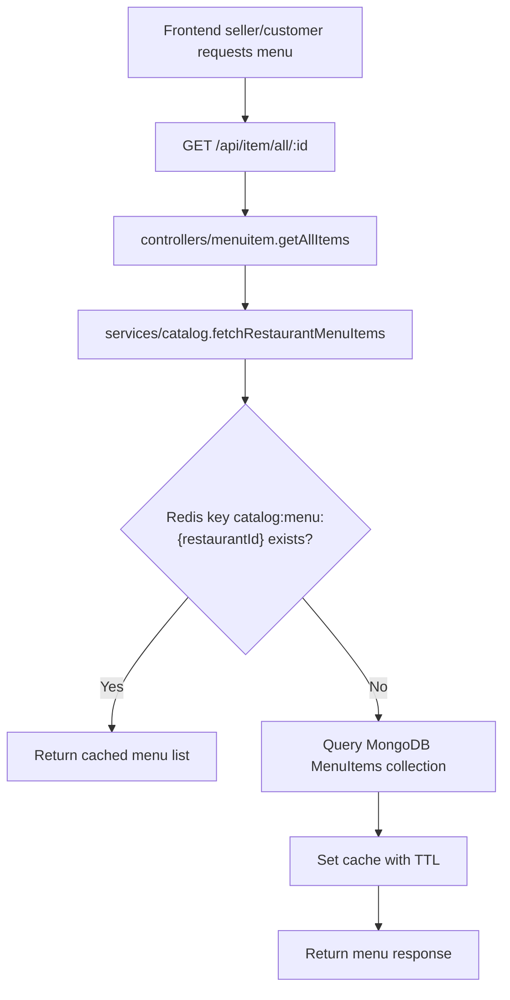
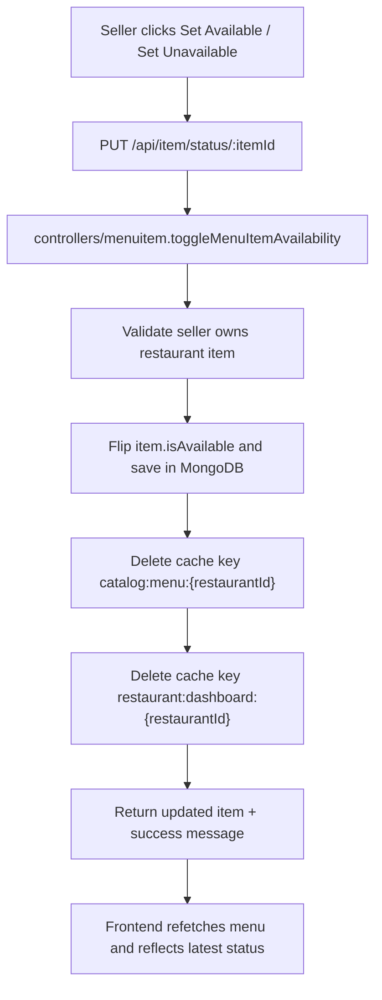
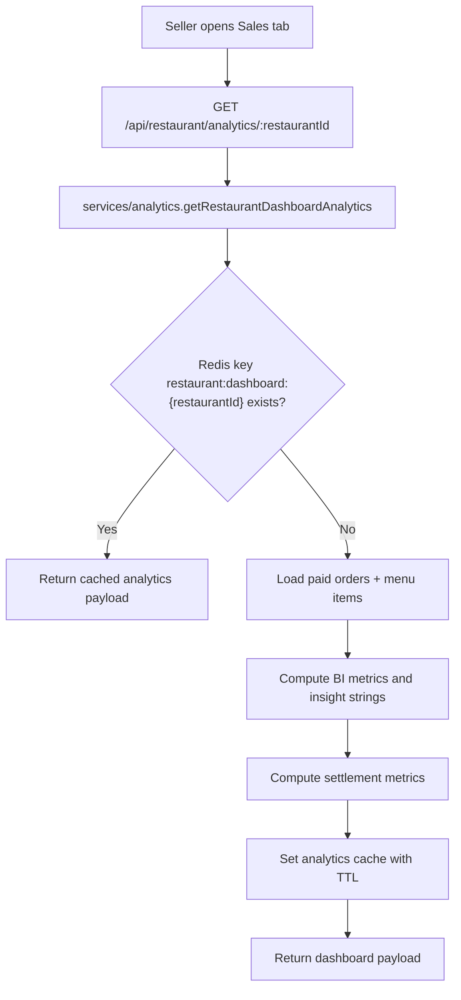
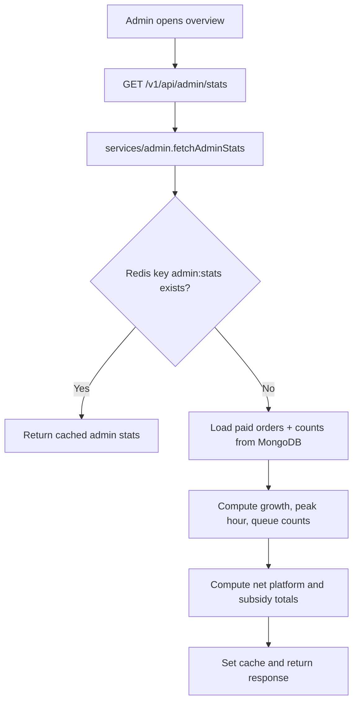
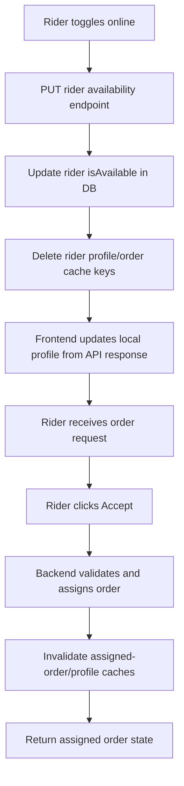
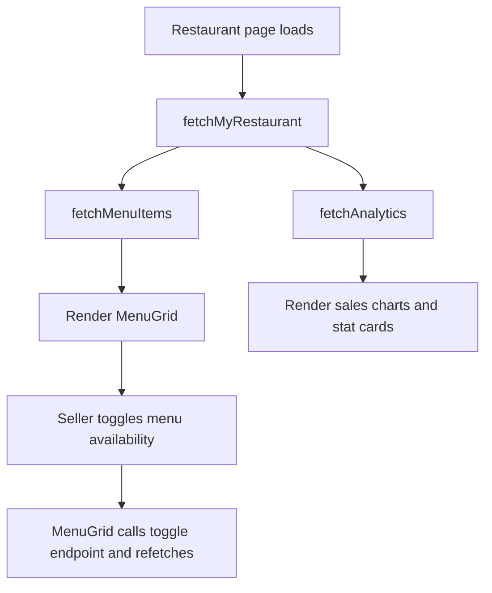

# BhookBuster Code Flow Guide

This document explains the practical code-level flow for major BhookBuster paths.
Use it for onboarding, debugging, and interview walkthroughs.

## 1. Restaurant Menu Read Flow

Key files:
- `services/restaurant/src/routes/menuitem.ts`
- `services/restaurant/src/controllers/menuitem.ts`
- `services/restaurant/src/services/catalog.ts`
- `services/restaurant/src/cache/redis.ts`

## 2. Menu Availability Toggle Flow (Fixed)

Why this fix was required:
- The menu endpoint was cached, but toggle/delete/create mutations were not invalidating cache.
- Result: UI looked stale for up to TTL duration even when DB had changed.

## 3. Restaurant Analytics Flow

Settlement metrics now included:
- `customerDeliveryFees`
- `riderPayout`
- `platformSubsidy`
- `netPlatformRevenue`

## 4. Admin Stats Flow

## 5. Rider Availability + Accept Flow (Stabilized)

Reliability details:
- Rider service now resolves internal URLs with fallback (`*_SERVICE_URL` then `*_SERVICE`).
- Consumer-side failures now acknowledge queue messages to avoid stuck unacked deliveries.
- Restaurant service now asserts `ORDER_READY_QUEUE` before publishing ready-for-rider events.

## 6. Frontend Component Flow (Restaurant Seller)

Key files:
- `frontend/src/pages/Restaurant.tsx`
- `frontend/src/components/MenuGrid.tsx`

## 7. Debug Checklist For Stale UI

1. Confirm mutation endpoint returns success and updated entity.
2. Confirm related cache keys are deleted on mutation.
3. Confirm frontend refetch runs after mutation.
4. Confirm response is not served from stale client state only.
5. Confirm TTL values match expected freshness.
