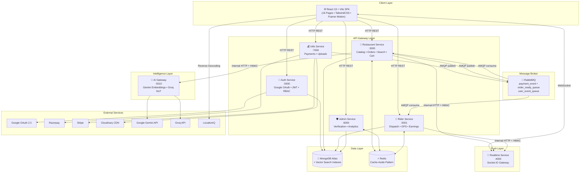
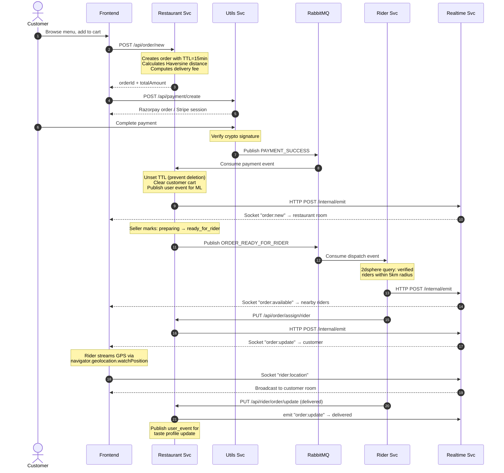
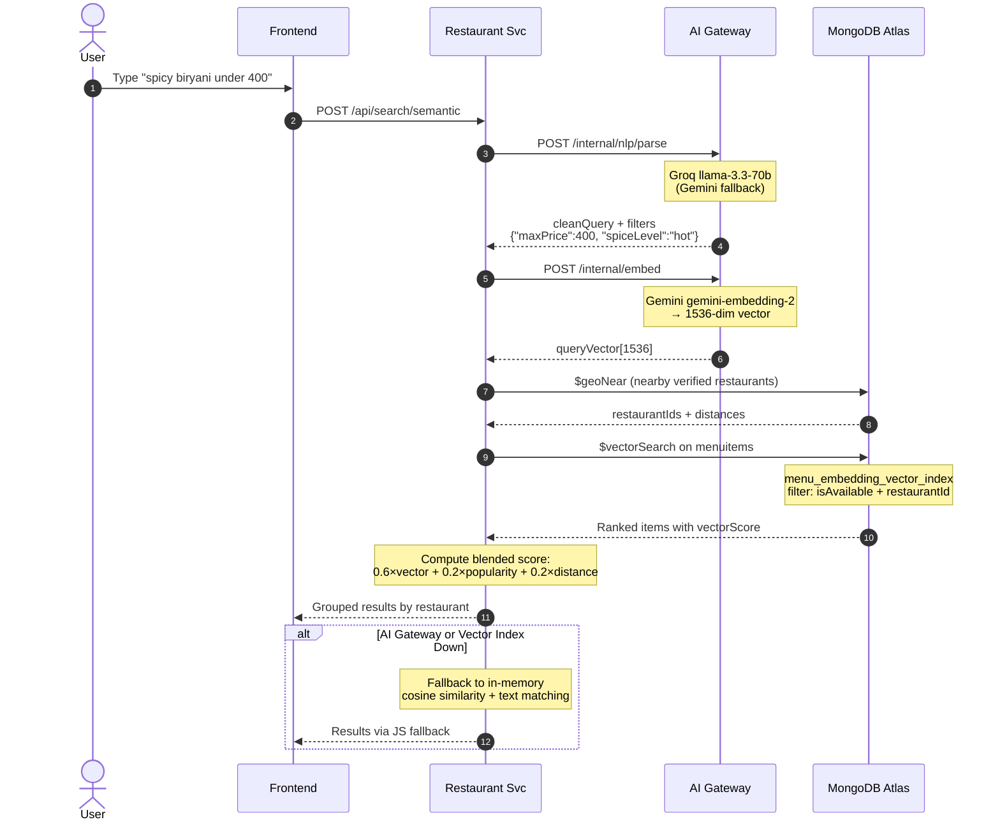
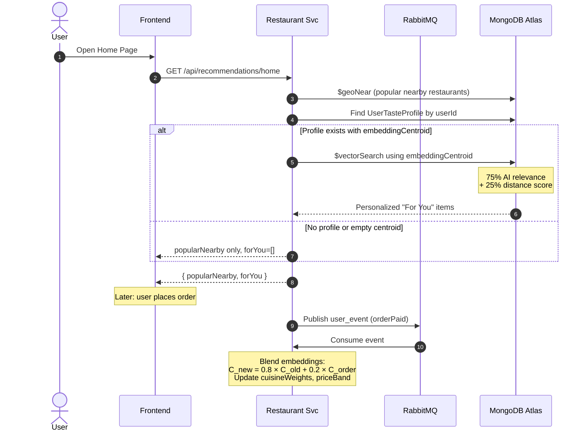
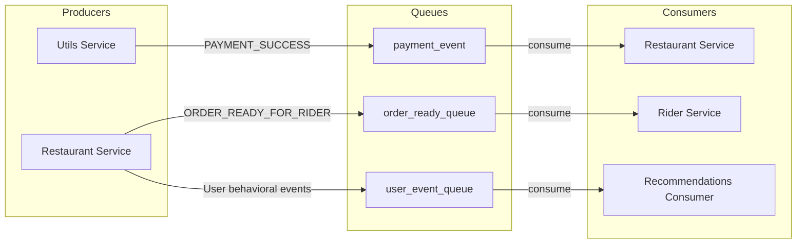
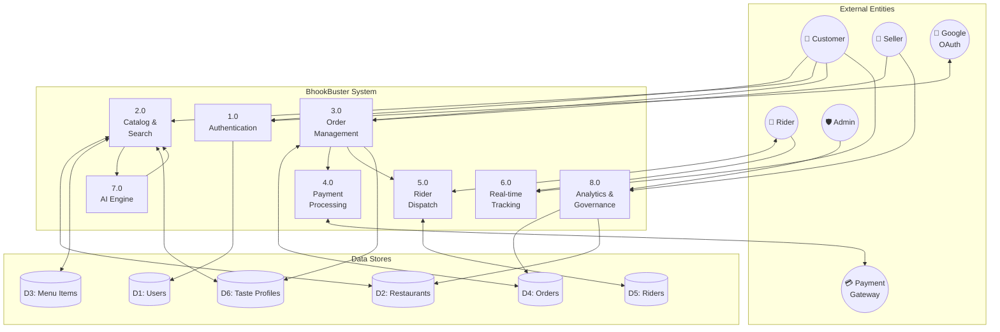
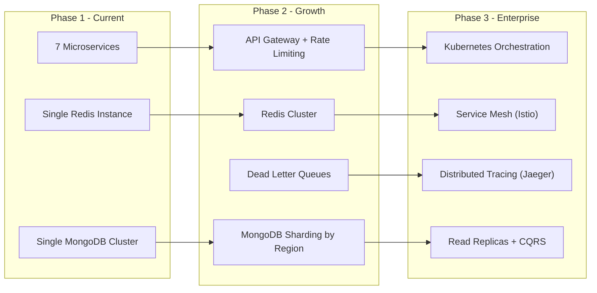
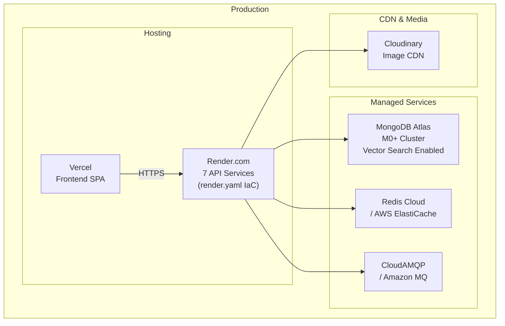

# BhookBuster — High-Level Design (HLD)

> **Version:** 2.0 &nbsp;|&nbsp; **Last Updated:** June 2026 &nbsp;|&nbsp; **Author:** Pradeep Modak

---

## 1. Problem Statement

Build a **food delivery platform** that allows customers to discover restaurants, search menus using natural language, place orders with real-time payment processing, and track deliveries via live GPS — all while supporting distinct workflows for restaurant owners, delivery riders, and platform administrators.

### Key Challenges
- Natural language food search (*"healthy vegan under 300 rupees"*)
- Real-time order tracking with live rider GPS
- Multi-role RBAC (customer, seller, rider, admin)
- Payment processing with automatic cleanup of abandoned orders
- Personalized recommendations that learn from user behavior
- System resilience — no single dependency failure should take down the app

---

## 2. System Architecture

### 2.1 High-Level Architecture Diagram

### 2.2 Service Boundary Table

| Service | Port | Responsibility | Owns Data? | Stateful? |
|:--------|:----:|:---------------|:----------:|:---------:|
| **auth** | 5000 | Google OAuth exchange, JWT issuance, RBAC | `users` collection | No |
| **restaurant** | 3000 | Menu catalog, cart, orders, search, recommendations | `restaurants`, `menuitems`, `orders`, `carts`, `addresses`, `userfoodevents`, `usertasteprofiles` | No |
| **rider** | 5001 | Rider profiles, availability, dispatch, delivery | `riders` | No |
| **admin** | 6000 | Verification queues, platform analytics, governance | None (reads across services) | No |
| **utils** | 7000 | Payment gateway orchestration, media uploads | None | No |
| **realtime** | 4000 | WebSocket event fanout (rooms, GPS streaming) | None | Yes (connections) |
| **ai-gateway** | 5010 | Embedding generation, NLP parsing, analytics insights | None | No |

---

## 3. Core User Flows

### 3.1 Order Lifecycle (End-to-End)

### 3.2 AI Semantic Search Flow

### 3.3 Personalized Recommendations Flow

---

## 4. Communication Patterns

### 4.1 Synchronous (HTTP REST)

| From → To | Method | Purpose |
|:----------|:------:|:--------|
| Frontend → Any service | REST | All user-facing API calls |
| Restaurant → AI Gateway | POST | Embedding generation, NLP parsing |
| Restaurant → Realtime | POST | Internal event emission (HMAC-signed) |
| Rider → Restaurant | PUT | Assign rider to order |
| Rider → Realtime | POST | Internal event emission (HMAC-signed) |

### 4.2 Asynchronous (RabbitMQ AMQP)

| Queue | Producer | Consumer | Trigger |
|:------|:---------|:---------|:--------|
| `payment_event` | utils | restaurant | Payment verified via Razorpay/Stripe |
| `order_ready_queue` | restaurant | rider | Seller marks order as `ready_for_rider` |
| `user_event_queue` | restaurant | restaurant (recommendations) | Order paid, search, cart add, rating |

### 4.3 Real-Time (WebSocket / Socket.IO)

| Event | Direction | Room | Payload |
|:------|:----------|:-----|:--------|
| `order:new` | Server → Client | `restaurant:{id}` | New order notification |
| `order:update` | Server → Client | `user:{id}` | Status change (preparing, picked_up, etc.) |
| `order:available` | Server → Client | `user:{riderId}` | New dispatch request for nearby rider |
| `rider:location` | Client → Server → Client | `user:{customerId}` | Live GPS coordinates |

---

## 5. Technology Decisions

| Layer | Technology | Why |
|:------|:-----------|:----|
| **Frontend** | React 19, Vite, TailwindCSS v4 | Latest React with fast HMR, utility-first CSS |
| **Backend** | Node.js, Express, TypeScript | Consistent language across stack, strong typing |
| **Database** | MongoDB Atlas | Native vector search, 2dsphere indexes, TTL indexes, flexible schema |
| **Cache** | Redis | Sub-ms reads for dashboards and profiles |
| **Message Broker** | RabbitMQ | Reliable delivery, manual acknowledgment, dead-letter support |
| **Real-time** | Socket.IO (dedicated service) | Room-based event fanout, decoupled from REST lifecycle |
| **AI/ML** | Gemini `gemini-embedding-2`, Groq `llama-3.3-70b` | Production-grade embeddings + fast NLP inference |
| **Payments** | Razorpay + Stripe | Dual gateway for Indian + international markets |
| **Maps** | Leaflet, LocationIQ | Free OSM-based maps, reverse geocoding |
| **CDN** | Cloudinary | On-the-fly image transformations |
| **Auth** | Google OAuth 2.0 + JWT | Zero-password onboarding, stateless auth |

---

## 6. Data Flow Diagram (DFD Level 0)

---

## 7. Scalability Considerations

### 7.1 Current Optimizations

| Optimization | Implementation |
|:-------------|:---------------|
| **Read caching** | Redis cache-aside with TTLs (60s–5m) on all read-heavy routes |
| **Event-driven processing** | Payment → fulfillment → dispatch fully async via RabbitMQ |
| **Database cleanup** | MongoDB TTL index auto-deletes unpaid orders (no cron jobs) |
| **Search performance** | Atlas Vector Search pre-filtered by geospatial bounds |
| **Geospatial indexing** | 2dsphere on restaurants and riders for O(log n) proximity queries |
| **Connection isolation** | WebSocket gateway decoupled from REST services |

### 7.2 Future Scale Roadmap

---

## 8. Deployment Architecture

| Component | Production | Local Development |
|:----------|:-----------|:------------------|
| Frontend | Vercel (auto-deploy from `main`) | `npm run dev` → localhost:5173 |
| API Services | Render Web Services × 7 | Individual `npm run dev` per service |
| MongoDB | Atlas M0+ (Vector Search) | Atlas (required for vector indexes) |
| Redis | Redis Cloud / ElastiCache | `redis://localhost:6379` |
| RabbitMQ | CloudAMQP / Amazon MQ | Docker: `docker compose up -d` |

---

## 9. Security Architecture

| Layer | Mechanism | Implementation |
|:------|:----------|:---------------|
| **User Auth** | Google OAuth 2.0 → JWT (15-day expiry) | `@react-oauth/google` + `jsonwebtoken` |
| **API Auth** | Bearer token in `Authorization` header | `isAuth` middleware on every protected route |
| **RBAC** | Role-based middleware chain | `isSeller`, `isAdmin` guard specific routes |
| **Service-to-Service** | HMAC-signed internal key | `x-internal-key` header validated at realtime gateway |
| **AI Gateway** | HMAC secret | `GATEWAY_HMAC_SECRET` shared between services |
| **Payments** | Cryptographic signature verification | `crypto.createHmac('sha256')` for Razorpay; session verification for Stripe |
| **Data** | MongoDB Atlas encryption at rest | TLS in transit, field-level encryption available |

---

## 10. Failure Modes & Resilience

| Failure | Impact | Mitigation |
|:--------|:-------|:-----------|
| AI Gateway down | No embeddings for search | JS cosine similarity fallback + text matching |
| Atlas Vector Search misconfigured | `$vectorSearch` returns 0 results | Automatic fallback to in-memory scoring |
| Redis unavailable | Cache misses | Cache-aside silently falls through to MongoDB |
| RabbitMQ connection lost | Events not processed | Automatic reconnection with backoff; manual ack prevents message loss |
| Payment timeout | Unpaid order lingers | MongoDB TTL auto-deletes after 15 minutes |
| Realtime service restart | WebSocket connections drop | Clients auto-reconnect; no REST impact |
| Rider geofence finds no riders | Order stuck at `ready_for_rider` | Periodic re-query; admin visibility in dashboard |
