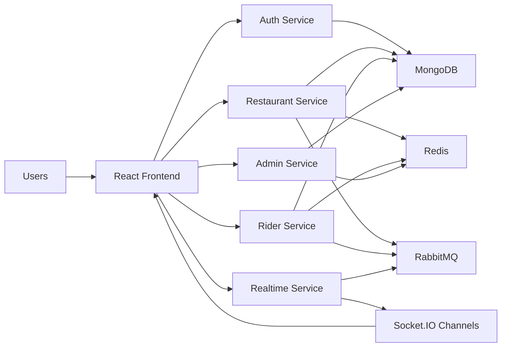
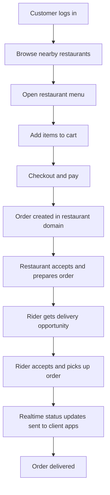
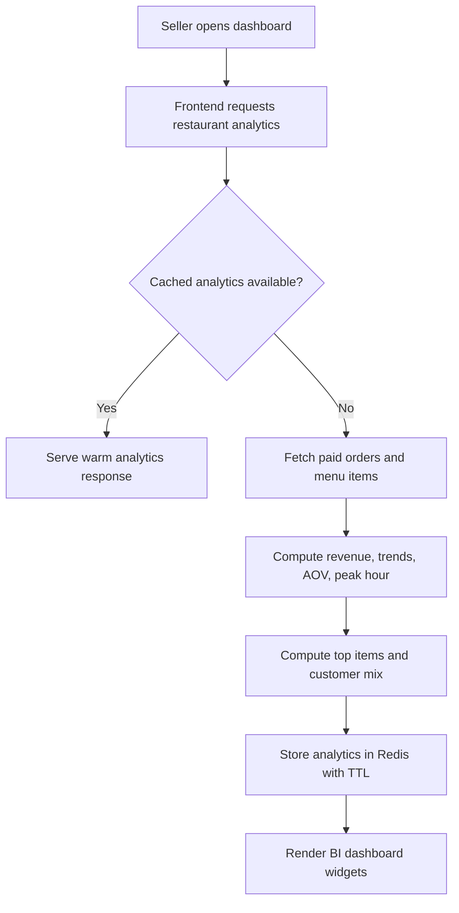
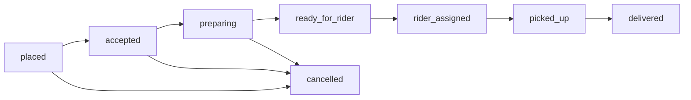

# BhookBuster Interview Prep For SDE Roles

This file is designed for FAANG-style or strong product-company interviews where you need to explain:
- what the project does
- what you specifically built
- why your decisions matter
- what tradeoffs you made
- how you would improve it further

## 1. One-Line Pitch

Built a microservice-style food delivery platform with customer, restaurant, rider, and admin workflows, then improved read-heavy backend performance with Redis cache-aside caching across `3` services, added BI-style analytics, and surfaced platform economics (delivery fee, rider payout, subsidy, net revenue) in dashboards.

## 1.1 Current Status Snapshot (April 11, 2026)

- Core builds passing: frontend, restaurant, admin, rider
- Rider availability and order-accept stability fixes shipped
- Rider dispatch reliability fixes shipped (queue ack hardening + internal URL normalization)
- Seller menu availability toggle fixed end to end with cache invalidation
- Admin and restaurant dashboards now include settlement visibility

## 2. Two-Minute Project Explanation

BhookBuster is a full-stack food delivery platform with a React frontend and multiple backend services for auth, restaurant operations, rider workflows, admin analytics, realtime updates, and utility tasks. The project supports different user roles, so it is not just a single dashboard or CRUD app.

The most meaningful engineering work I did was in three areas. First, I standardized Redis cache-aside caching across the admin, restaurant, and rider services to reduce repeated DB and aggregation work on hot endpoints. Second, I added seller-facing restaurant analytics including revenue trends, hourly demand, top-selling items, customer mix, and week-over-week growth so the project had actual business intelligence rather than only transactional features. Third, I introduced reusable frontend UI primitives and migrated shared surfaces to a more maintainable design system.

From an interview perspective, I would describe this as a project that combines product engineering, systems design, and performance thinking in one codebase.

## 2.1 Architecture Flowchart

Use this when the interviewer asks you to explain the system at a high level.

How to explain it:
- The React frontend talks to multiple domain-specific services instead of one large backend.
- MongoDB is the source of truth for persistent business data.
- Redis is used for hot reads and repeated dashboard/listing requests.
- RabbitMQ handles asynchronous coordination.
- Socket.IO is used for realtime order state updates.

## 2.2 Customer Order Flowchart

Use this when explaining the end-to-end product flow.

How to explain it:
- The customer journey touches discovery, ordering, payment, restaurant operations, rider dispatch, and realtime tracking.
- This is useful in interviews because it shows the project is not just a dashboard app.

## 2.3 Redis Cache-Aside Flowchart

Use this when explaining performance optimization.

```mermaid
flowchart TD
    R["Incoming read request"] --> C{"Is data in Redis?"}
    C -- Yes --> H["Return cached response"]
    C -- No --> D["Query MongoDB / compute analytics"]
    D --> W["Write result to Redis with TTL"]
    W --> O["Return response"]
    C -. Redis failure .-> F["Graceful fallback to DB read"]
    F --> O
```

How to explain it:
- The service checks Redis first for hot read paths.
- On a miss, it computes or fetches from MongoDB and stores the result with a TTL.
- If Redis is unavailable, the service still returns a response by falling back to the database.

## 2.4 Restaurant Analytics Flowchart

Use this when explaining why the seller dashboard is more than CRUD.

How to explain it:
- The dashboard is backed by server-side analytics, not only client-side transformations.
- Redis reduces repeated aggregation work for seller dashboards.

## 2.5 Order State Lifecycle

Use this when explaining domain modeling and realtime behavior.

How to explain it:
- The order lifecycle is explicit, which makes restaurant actions, rider actions, and realtime notifications easier to model.
- This also helps when talking about state machines and backend workflow design.

## 3. Resume-Style Impact Statements

Use these as speaking bullets, not just resume text.

- Improved repeated-read backend performance by implementing Redis cache-aside caching across `3` services.
- Reduced redundant database and aggregation work on hot endpoints such as admin stats, restaurant analytics, and rider queue/profile reads.
- Built a BI-style restaurant analytics module with revenue series, peak-hour detection, top items, customer mix, and week-over-week growth.
- Added settlement analytics fields to dashboard payloads so platform economics are visible, not implicit.
- Standardized shared frontend UI primitives to reduce duplicated component styling and improve maintainability across dashboards and core pages.
- Verified major services with successful builds to keep the project in a demonstrably working state.

## 4. Safe Metrics You Can Claim

Only claim numbers you can defend.

- `4` major apps/services verified with successful builds: frontend, admin, restaurant, rider
- `3` services upgraded with Redis caching: admin, restaurant, rider
- `1` dedicated restaurant analytics feature
- `4` settlement KPIs now exposed in analytics: delivery fee, rider payout, subsidy, net platform revenue
- `1` shared UI primitive layer applied across major shared surfaces
- `7-day` trend windows in dashboards
- `5000m` default restaurant discovery radius

## 5. How To Talk About Latency Honestly

If you did not run a full benchmark study, do not invent millisecond improvements.

Say:
- "I reduced repeated DB and network fetch latency on read-heavy endpoints by introducing Redis cache-aside caching."
- "I improved repeated-read responsiveness for analytics and dashboard endpoints."
- "I reduced unnecessary recomputation on hot reads."
- "I designed the system so warm-cache reads avoid repeated expensive backend work."

If asked for exact numbers:

> I validated the architecture path and successful builds, and I would measure exact p95 latency improvements using load testing tools like autocannon before claiming formal production numbers.

## 6. Strong Answers To Common Interview Questions

### Q: Why microservices here instead of one monolith?

Because the domain boundaries are naturally different: auth, restaurant operations, rider workflows, admin analytics, realtime messaging, and utilities all have distinct responsibilities. Even though this is a project and not a hyperscale company system, splitting them made it easier to reason about ownership, integrations, and cross-service communication.

### Q: Why did you add Redis?

Because some endpoints are clearly read-heavy and expensive to recompute repeatedly, especially analytics and dashboard-style reads. Redis helps reduce repeated DB and aggregation work, improves warm-read responsiveness, and gives a cleaner path to scale those endpoints without rewriting the whole service.

### Q: Why cache-aside?

Cache-aside is simple and practical. The service first checks Redis, falls back to the database on a miss, then writes the result into cache. It is easier to adopt incrementally than a more complex write-through or event-heavy strategy.

### Q: What tradeoff did you make with caching?

I used TTL-based freshness rather than trying to build perfect invalidation everywhere. That means some reads can be slightly stale within the TTL window, but the implementation is safer and lower-risk for a project of this size.

### Q: How did you keep the system reliable if Redis is down?

I used graceful fallback. If Redis is unavailable, the services still fetch directly from the database instead of failing the request.

### Q: What made the project more than a CRUD app?

The combination of multi-role flows, caching, analytics, realtime updates, async messaging, and deployment-oriented structure. The seller dashboard in particular adds business intelligence, not just record management.

## 7. STAR Stories You Can Use

### Story A: Redis Caching

Situation:
Dashboard and analytics endpoints were doing repeated read-heavy work.

Task:
Improve repeated-read performance without rewriting the whole backend.

Action:
Added Redis helpers, centralized TTL buckets, and used a cache-aside pattern in admin, restaurant, and rider services with graceful fallback.

Result:
Reduced repeated DB/aggregation work, improved warm-read responsiveness, and created a more scalable structure for hot endpoints.

### Story B: Restaurant Analytics

Situation:
The seller side had operations data but not enough business insight for decision-making.

Task:
Make the seller experience more interview-worthy and more product-realistic.

Action:
Added analytics for revenue trends, hourly demand, top items, low-performing items, customer mix, and week-over-week growth.

Result:
Turned the seller dashboard into a BI-style operational product rather than a simple order list.

### Story D: Fixing "Broken" Availability Toggle

Situation:
Restaurant owners reported that available/unavailable looked broken.

Task:
Ensure menu availability updates feel immediate and trustworthy.

Action:
Traced the issue to stale Redis menu cache after write operations, added cache invalidation on add/delete/toggle endpoints, and upgraded seller menu card controls with explicit status actions and loading feedback.

Result:
Availability changes now reflect correctly after mutation and the seller UI is clearer and more production-like.

### Story E: Rider Dispatch Reliability Incident

Situation:
Riders were online but sometimes did not receive or accept incoming order opportunities consistently.

Task:
Make rider dispatch and acceptance more robust under real-world environment/config variance.

Action:
Normalized internal service URL resolution (`*_SERVICE_URL` fallback to `*_SERVICE`), hardened queue-consumer acknowledgement behavior, asserted ready-for-rider queue on publisher side, and fixed rider dashboard location error handling to avoid stuck toggles.

Result:
Incoming rider opportunities and accept calls became more reliable, with fewer silent failures caused by config mismatches or unacked queue messages.

### Story C: Frontend Design System

Situation:
The frontend had inconsistent one-off styling across pages.

Task:
Make shared UI more maintainable and more polished.

Action:
Introduced reusable primitives like `Button`, `Card`, `Input`, `StatCard`, and migrated key surfaces to them.

Result:
Reduced duplication, improved consistency, and made future UI work faster.

## 8. If The Interviewer Pushes On Scale

Good answer:

> I would not claim this is operating at FAANG scale, but I designed it with the kinds of concerns that matter at scale: separating domains, reducing repeated hot-path work, isolating realtime behavior, and using async messaging where coordination does not need to be synchronous.

## 9. If They Ask What You Would Improve Next

- add route-level code splitting to reduce the frontend bundle size
- add formal load testing for cached vs uncached endpoints
- add broader cache invalidation hooks for write-heavy mutations
- add automated integration tests around analytics and caching
- add centralized observability for latency, cache hit rate, and queue lag

## 10. Best "Tell Me About Your Project" Answer

BhookBuster is a full-stack food delivery platform built with a React frontend and a microservice-style backend. It supports customer ordering, restaurant operations, rider delivery flows, and admin verification/analytics. The most meaningful engineering work I did was improving repeated-read backend performance using Redis cache-aside caching across three services, adding BI-style analytics for restaurant dashboards, and standardizing the frontend through reusable UI primitives. I like this project for interviews because it lets me talk about product engineering, system tradeoffs, performance optimization, and maintainability in one example.

## 11. Best "What Was Technically Challenging?" Answer

The challenge was balancing product improvement with architectural discipline. It is easy to keep adding features directly in controllers or page components, but I tried to move read-heavy logic into service layers, introduce caching where it mattered, and keep graceful fallback behavior so the system remained usable even when cache was unavailable.

## 12. Best "What Did You Learn?" Answer

I learned how to think beyond "feature complete" and toward production-style engineering. That means choosing where caching is justified, accepting TTL-based tradeoffs instead of overengineering invalidation, designing reusable UI instead of duplicating components, and verifying the project through builds rather than assumptions.

