# BhookBuster — Low-Level Design (LLD)

> **Version:** 2.0 &nbsp;|&nbsp; **Last Updated:** June 2026 &nbsp;|&nbsp; **Author:** Pradeep Modak

---

## 1. Database Schema Design

### 1.1 Entity-Relationship Diagram

```mermaid
erDiagram
    USERS {
        ObjectId _id PK
        String name
        String email UK "Unique Index"
        String image
        String role "customer | seller | rider | null"
        Date createdAt
        Date updatedAt
    }

    RESTAURANTS {
        ObjectId _id PK
        String name
        String description
        String image
        String ownerId FK "→ Users._id"
        Number phone
        Boolean isVerified "Indexed"
        Array cuisineTypes "String[]"
        Array tags "String[]"
        Array embedding "Number[1536]"
        String embeddingHash
        Date embeddedAt
        Object autoLocation "GeoJSON Point + 2dsphere index"
        Boolean isOpen
        Date createdAt
    }

    MENUITEMS {
        ObjectId _id PK
        ObjectId restaurantId FK "→ Restaurants._id (Indexed)"
        String name
        String description
        String image
        Number price
        String cuisine
        Array tags "String[]"
        Array dietaryFlags "String[] (Indexed)"
        String spiceLevel "mild | medium | hot | extra-hot"
        Array embedding "Number[1536]"
        Boolean isAvailable "Indexed"
        Date createdAt
    }

    ORDERS {
        ObjectId _id PK
        String userId FK "Indexed"
        String restaurantId FK "Indexed"
        String restaurantName
        String riderId FK "Indexed, nullable"
        String riderName
        String riderPhone
        Number riderAmount
        Number distance
        Array items "itemId, name, price, quantity"
        Number subtotal
        Number deliveryFee
        Number platformFee
        Number totalAmount
        String addressId FK
        Object deliveryAddress "formattedAddress, mobile, lat, lng"
        String status "8 states (enum)"
        String paymentMethod "razorpay | stripe"
        String paymentStatus "pending | paid | failed"
        Date expiresAt "TTL Index: expireAfterSeconds=0"
        Date createdAt
    }

    CARTS {
        ObjectId _id PK
        ObjectId userId FK "Indexed"
        ObjectId restaurantId FK "Indexed"
        ObjectId itemId FK "Indexed"
        Number quantity "min: 1"
    }

    ADDRESSES {
        ObjectId _id PK
        ObjectId userId FK "Indexed"
        String formattedAddress
        Number mobile
        Number latitude
        Number longitude
    }

    RIDERS {
        ObjectId _id PK
        String userId FK UK "Unique"
        String picture
        String phoneNumber
        String aadharNumber
        String drivingLicenseNumber
        Boolean isVerified
        Object location "GeoJSON Point + 2dsphere index"
        Boolean isAvailable
        Date lastActiveAt
    }

    USERTASTEPROFILES {
        ObjectId _id PK
        ObjectId userId FK UK "Unique Index"
        Map cuisineWeights "cuisine → weight"
        Object priceBand "min, max"
        Array dietaryFlags "String[]"
        Array embeddingCentroid "Number[1536]"
        Date lastUpdatedAt
    }

    USERFOODEVENTS {
        ObjectId _id PK
        ObjectId userId FK "Indexed"
        String eventType "orderPaid | search | cartAdd | rating"
        Object metadata "orderId, query, itemId, etc."
        Date createdAt
    }

    USERS ||--o{ ORDERS : "places"
    USERS ||--o| RIDERS : "registers as"
    USERS ||--o| RESTAURANTS : "owns"
    USERS ||--o{ CARTS : "has"
    USERS ||--o{ ADDRESSES : "saves"
    USERS ||--o| USERTASTEPROFILES : "has"
    USERS ||--o{ USERFOODEVENTS : "generates"
    RESTAURANTS ||--o{ MENUITEMS : "contains"
    RESTAURANTS ||--o{ ORDERS : "receives"
    MENUITEMS ||--o{ CARTS : "added to"
    RIDERS ||--o{ ORDERS : "delivers"
```

### 1.2 Index Strategy

| Collection | Index | Type | Purpose |
|:-----------|:------|:-----|:--------|
| `users` | `email` | Unique | O(1) lookup during OAuth login |
| `restaurants` | `autoLocation` | 2dsphere | `$geoNear` for proximity search |
| `restaurants` | `isVerified` | Regular | Filter pending approvals |
| `restaurants` | `embedding` | Atlas Vector | `$vectorSearch` for restaurant discovery |
| `menuitems` | `restaurantId` | Regular | Fast menu lookups per restaurant |
| `menuitems` | `embedding` | Atlas Vector (`menu_embedding_vector_index`) | `$vectorSearch` for semantic dish search |
| `menuitems` | `dietaryFlags` | Regular | Filter by veg/non-veg |
| `menuitems` | `isAvailable` | Regular | Exclude unavailable items |
| `orders` | `userId` | Regular | Customer order history |
| `orders` | `restaurantId` | Regular | Seller order queue |
| `orders` | `riderId` | Regular | Rider active deliveries |
| `orders` | `expiresAt` | TTL (`expireAfterSeconds: 0`) | Auto-delete unpaid orders |
| `carts` | `{userId, restaurantId, itemId}` | Compound Unique | Prevent duplicate cart entries |
| `riders` | `location` | 2dsphere | Geofenced dispatch queries |
| `riders` | `userId` | Unique | One rider profile per user |
| `usertasteprofiles` | `userId` | Unique | One profile per user |

---

## 2. API Design — All Endpoints

### 2.1 Auth Service (`:5000`)

```
POST   /api/auth/login          → Exchange Google auth code for JWT
GET    /api/auth/me              → Get authenticated user profile
PUT    /api/auth/add/role        → Set user role (customer/seller/rider)
```

### 2.2 Restaurant Service (`:3000`)

#### Restaurant Management
```
POST   /api/restaurant/new              → Register new restaurant (seller)
GET    /api/restaurant/my               → Get seller's own restaurant
GET    /api/restaurant/all              → List all restaurants (with location)
GET    /api/restaurant/:id              → Get restaurant by ID
PUT    /api/restaurant/:id              → Update restaurant details
PUT    /api/restaurant/toggle/:id       → Toggle restaurant open/close
```

#### Menu Items
```
POST   /api/menuitem/new                → Add menu item (triggers embedding generation)
GET    /api/item/all/:restaurantId      → Get all items for a restaurant
PUT    /api/item/status/:itemId         → Toggle item availability
DELETE /api/item/:itemId                → Delete menu item
```

#### Cart
```
POST   /api/cart/add                    → Add item to cart
GET    /api/cart/all                    → Get user's cart
PUT    /api/cart/decrement              → Decrement item quantity
DELETE /api/cart/:id                    → Remove item from cart
```

#### Orders
```
POST   /api/order/new                   → Create pending order (TTL=15min)
GET    /api/order/payment/:orderId      → Get order for payment checkout
GET    /api/order/all                   → Customer order history
GET    /api/order/:orderId              → Get order by ID
PUT    /api/order/:orderId              → Seller updates status
PUT    /api/order/assign/rider          → Internal: assign rider to order
GET    /api/restaurant/orders/:id       → Seller: get restaurant's orders
```

#### Search
```
POST   /api/search/semantic             → AI semantic dish search
POST   /api/search/restaurants          → AI semantic restaurant search
```

#### Recommendations
```
GET    /api/recommendations/home        → Personalized home feed (For You + Popular Nearby)
```

#### Analytics
```
GET    /api/restaurant/analytics/:id    → Seller dashboard analytics
POST   /api/restaurant/analytics/insights → AI-generated business insights
```

#### Addresses
```
POST   /api/address/new                 → Add delivery address
GET    /api/address/all                 → Get saved addresses
DELETE /api/address/:id                 → Delete address
```

#### Events
```
POST   /api/events/track                → Track user food interaction events
```

### 2.3 Rider Service (`:5001`)

```
POST   /api/rider/new                   → Create rider profile
GET    /api/rider/me                    → Get rider profile
PUT    /api/rider/update                → Update rider profile
PATCH  /api/rider/toggle                → Toggle availability + update GPS
GET    /api/rider/order/queue           → Get available dispatch requests
POST   /api/rider/accept/:orderId      → Accept dispatch request
PUT    /api/rider/order/update/:orderId → Update delivery status
GET    /api/rider/earnings              → Get earnings history
GET    /api/rider/order/current         → Get current active order
```

### 2.4 Admin Service (`:6000`)

```
GET    /v1/api/admin/stats              → Platform-wide KPIs
GET    /v1/api/admin/orders-trend       → Order trend aggregations
GET    /v1/api/admin/top-items          → Best-selling items
GET    /v1/api/admin/restaurant/pending → Unverified restaurants
GET    /v1/api/admin/riders/pending     → Unverified riders
PATCH  /v1/api/verify/restaurant/:id    → Verify restaurant
PATCH  /v1/api/verify/rider/:id         → Verify rider
```

### 2.5 Utils Service (`:7000`)

```
POST   /api/payment/create              → Create Razorpay order
POST   /api/payment/verify              → Verify Razorpay payment signature
POST   /api/payment/stripe/create       → Create Stripe checkout session
POST   /api/upload                      → Upload image to Cloudinary
```

### 2.6 AI Gateway (`:5010`)

```
POST   /internal/embed                  → Generate text embeddings (Gemini)
POST   /internal/nlp/parse              → Parse search query into filters (Groq/Gemini)
POST   /internal/insights               → Generate business analytics insights
POST   /internal/rerank                 → Re-rank search results
```

### 2.7 Realtime Service (`:4000`)

```
POST   /api/v1/internal/emit            → HMAC-authenticated internal event push
```

**Socket.IO Events:**
```
connection    → Join user/restaurant/admin rooms
rider:location → GPS broadcast to customer room
order:update  → Status change notification
order:new     → New order notification to restaurant
disconnect    → Leave all rooms
```

---

## 3. Class/Module Design

### 3.1 Middleware Chain

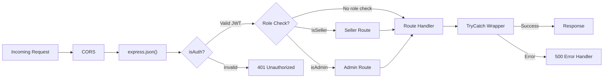

### 3.2 Cache-Aside Pattern Implementation

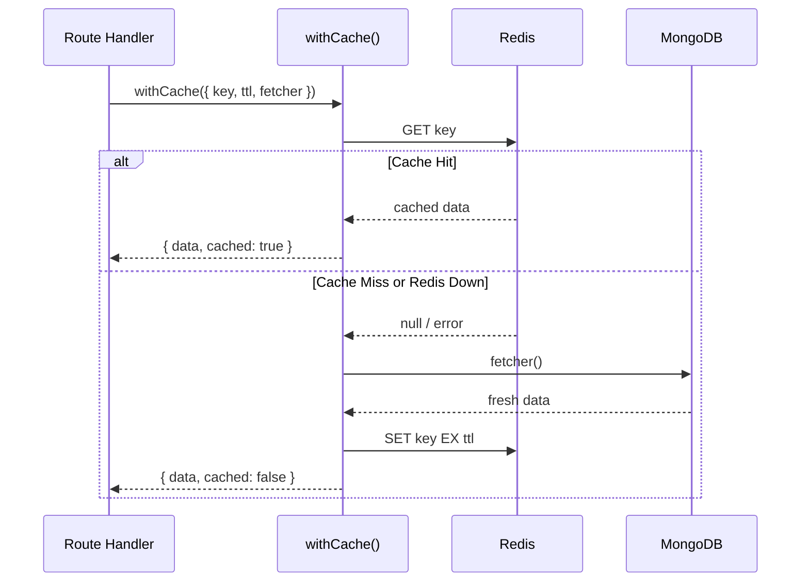

```typescript
// Core implementation
export const withCache = async <T>({ key, ttl, fetcher }: CacheOptions<T>) => {
  try {
    const cached = await getCache<T>(key);
    if (cached) return { data: cached, cached: true };
  } catch (e) {
    // Redis down — fall through to fetcher
  }
  const fresh = await fetcher();
  try {
    await setCache(key, fresh, ttl);
  } catch (e) {
    // Redis down — data still returns fine
  }
  return { data: fresh, cached: false };
};
```

### 3.3 Order State Machine

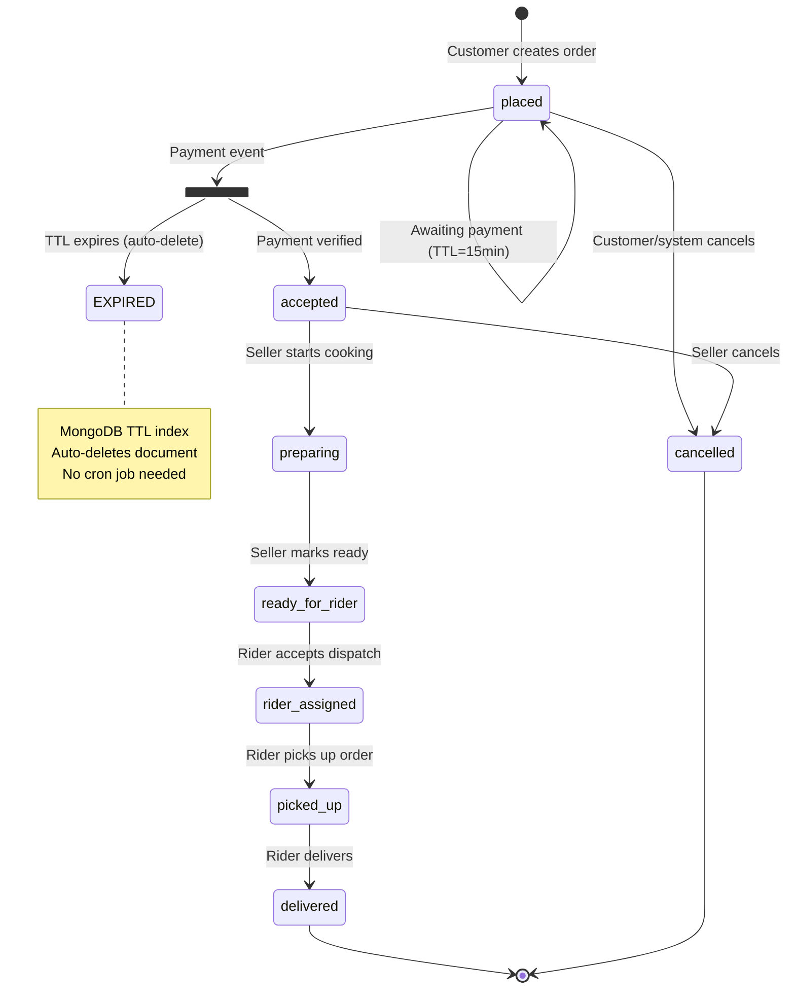

**Status transitions and who can trigger them:**

| Current Status | Next Status | Triggered By | RabbitMQ Event |
|:---------------|:------------|:-------------|:---------------|
| `placed` | `accepted` | Payment consumer | `PAYMENT_SUCCESS` consumed |
| `accepted` | `preparing` | Seller | — |
| `preparing` | `ready_for_rider` | Seller | `ORDER_READY_FOR_RIDER` published |
| `ready_for_rider` | `rider_assigned` | Rider service | — |
| `rider_assigned` | `picked_up` | Rider | — |
| `picked_up` | `delivered` | Rider | `user_event` published |
| Any pre-pickup | `cancelled` | Customer/Seller/Admin | — |

---

## 4. AI/ML Pipeline — Detailed Design

### 4.1 Embedding Generation Pipeline

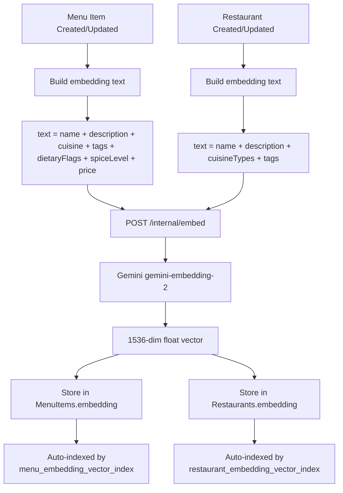

### 4.2 NLP Query Parsing

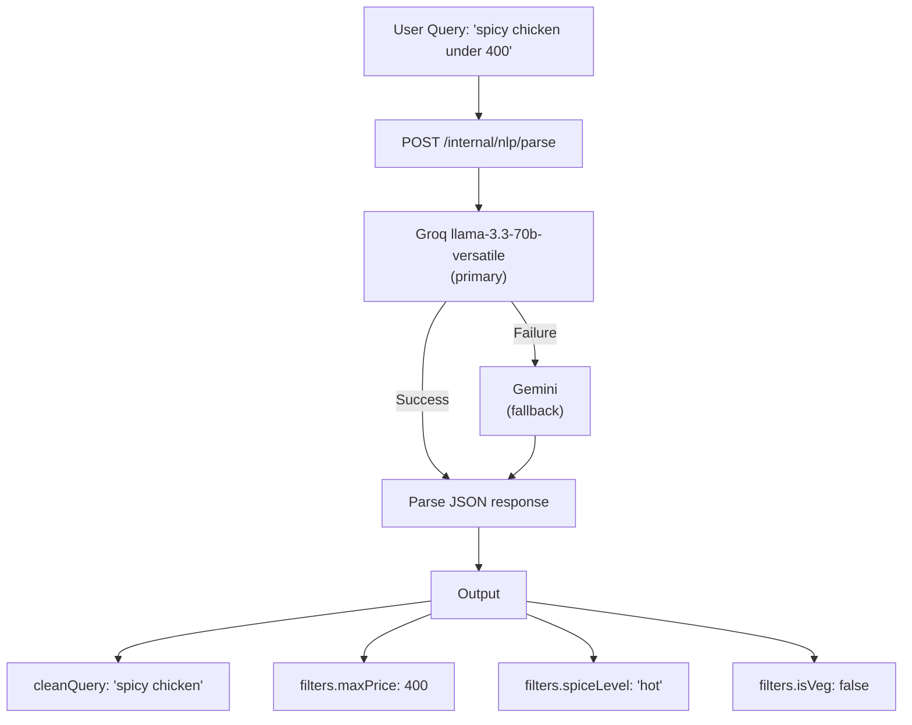

**LLM Prompt Template (simplified):**
```
Extract search filters from this food query. Return JSON:
{
  "cleanQuery": "the food description without filter words",
  "filters": {
    "maxPrice": number | null,
    "minPrice": number | null,
    "isVeg": boolean | null,
    "cuisine": string | null,
    "spiceLevel": "mild" | "medium" | "hot" | "extra-hot" | null
  }
}
Query: "{user_query}"
```

### 4.3 Blended Ranking Algorithm

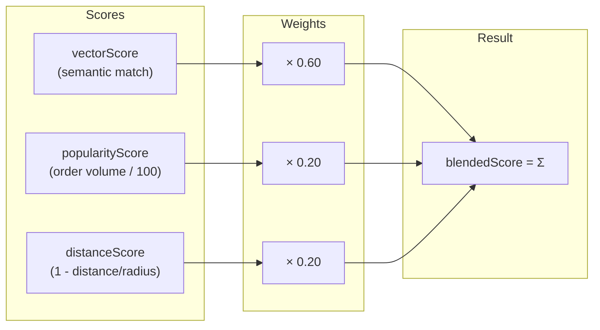

**For dish search:**
$$\text{blendedScore} = 0.6 \times \text{vectorScore} + 0.2 \times \text{popularityScore} + 0.2 \times \text{distanceScore}$$

**For "For You" recommendations:**
$$\text{recommendationScore} = 0.75 \times \text{vectorScore} + 0.25 \times \text{distanceScore}$$

**For restaurant search:**
$$\text{blendedScore} = 0.7 \times \text{vectorScore} + 0.3 \times \text{distanceScore}$$

### 4.4 Taste Profile Centroid Update Algorithm

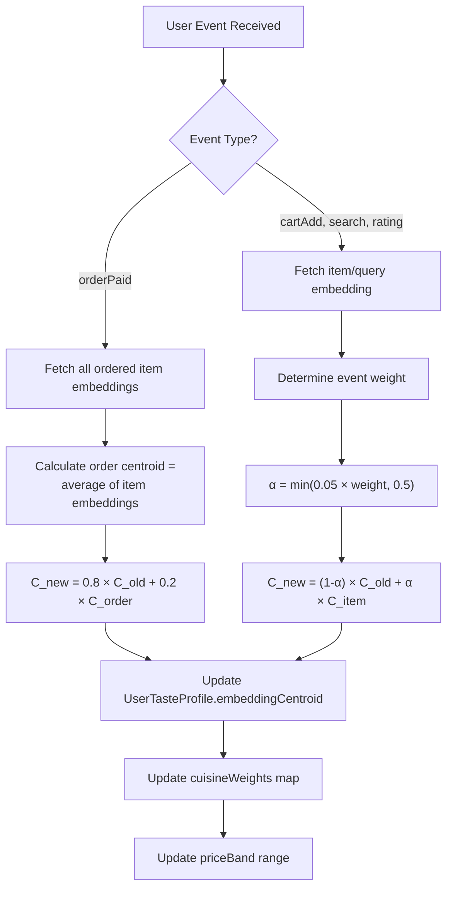

**Event weight table:**

| Event Type | Weight | Effective α | Interpretation |
|:-----------|:------:|:-----------:|:---------------|
| `orderPaid` | — | 0.20 (fixed) | Strongest signal — user spent real money |
| `rating` (positive) | 2.0 | 0.10 | Explicit preference signal |
| `cartAdd` | 1.5 | 0.075 | Strong intent signal |
| `click` | 1.0 | 0.05 | Moderate interest |
| `search` | 0.2 | 0.01 | Weak exploration signal |

---

## 5. Payment Processing — Detailed Flow

### 5.1 Razorpay Flow

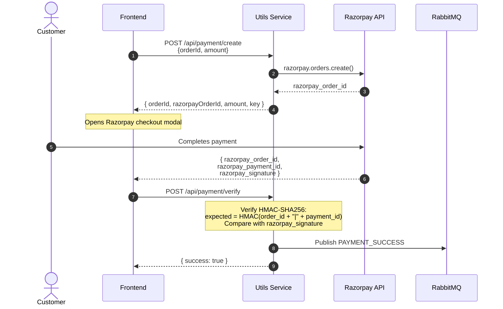

### 5.2 Stripe Flow

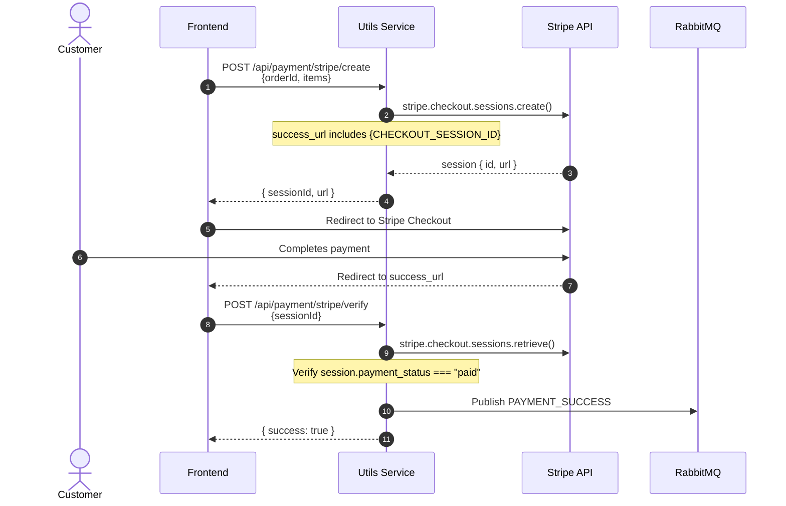

---

## 6. Real-Time GPS Tracking — Detailed Design

### 6.1 Component Interaction

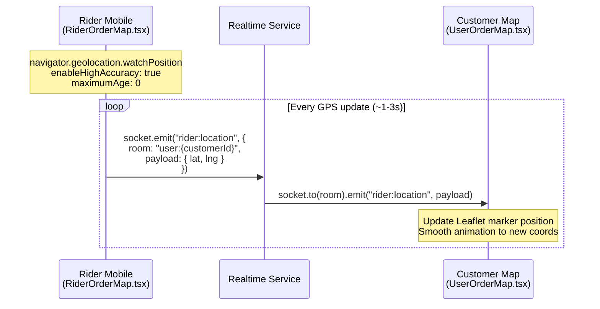

### 6.2 Map Stack

| Component | Library | Purpose |
|:----------|:--------|:--------|
| `RiderOrderMap.tsx` | `react-leaflet` + `leaflet-routing-machine` | Rider sees route + streams GPS |
| `UserOrderMap.tsx` | `react-leaflet` | Customer sees rider marker moving live |
| Tile Provider | OpenStreetMap | Free map tiles |
| Geocoding | LocationIQ API | Reverse geocoding for formatted addresses |

---

## 7. Frontend Component Architecture

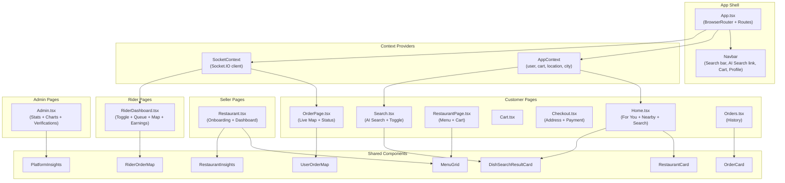

---

## 8. Error Handling Strategy

### 8.1 TryCatch Middleware Pattern

```typescript
// Every async controller is wrapped with this HOF
const TryCatch = (handler: RequestHandler) => async (req, res, next) => {
  try {
    await handler(req, res, next);
  } catch (error: any) {
    console.error(`[${req.method}] ${req.path}:`, error.message);
    res.status(error.statusCode || 500).json({
      message: error.message || "Internal Server Error",
    });
  }
};
```

### 8.2 Semantic Search Fallback Chain

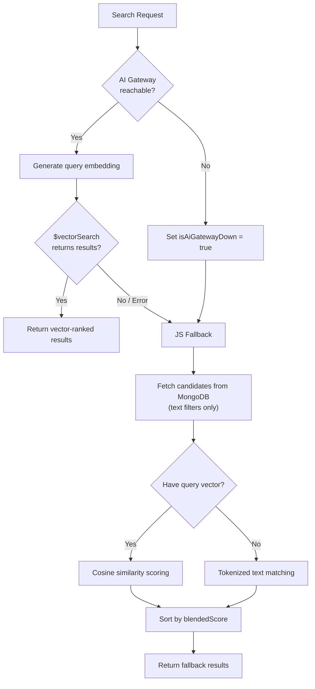

---

## 9. Geospatial Calculations

### 9.1 Haversine Formula in MongoDB Aggregation

The system calculates distances entirely within MongoDB aggregation pipelines using the Haversine formula:

$$d = R \times \arccos\left(\sin(\phi_1)\sin(\phi_2) + \cos(\phi_1)\cos(\phi_2)\cos(\Delta\lambda)\right)$$

Where $R = 6371$ km (Earth's radius), $\phi$ = latitude in radians, $\lambda$ = longitude in radians.

```javascript
// MongoDB aggregation pipeline stage
{
  $addFields: {
    distanceKm: {
      $multiply: [
        6371, // Earth radius in km
        {
          $acos: {
            $min: [1, {
              $max: [-1, {
                $add: [
                  { $multiply: [{ $sin: queryLatRad }, { $sin: "$restaurantLatRad" }] },
                  { $multiply: [
                    { $cos: queryLatRad },
                    { $cos: "$restaurantLatRad" },
                    { $cos: { $subtract: ["$restaurantLngRad", queryLngRad] } }
                  ]}
                ]
              }]
            }]
          }
        }
      ]
    }
  }
}
```

### 9.2 Rider Dispatch Geofencing

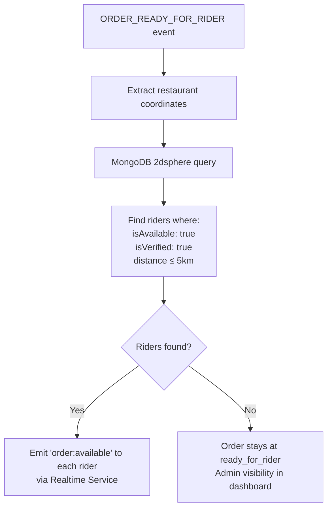

---

## 10. Delivery Fee & Settlement Calculation

### 10.1 Fee Breakdown

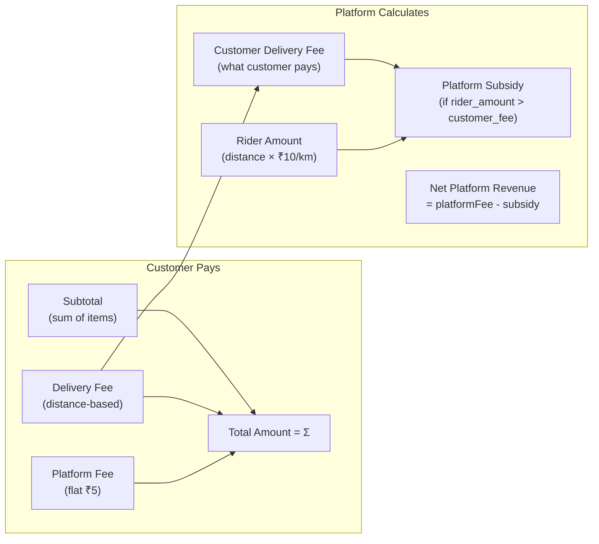

**Rider payout formula:**
$$\text{riderAmount} = \text{distance(km)} \times 10$$

**Delivery fee (customer-facing):**
$$\text{deliveryFee} = \begin{cases} 0 & \text{if distance} \leq 2\text{km} \\ \text{distance} \times 7 & \text{otherwise} \end{cases}$$

**Platform subsidy:**
$$\text{platformSubsidy} = \max(0, \text{riderAmount} - \text{customerDeliveryFee})$$
