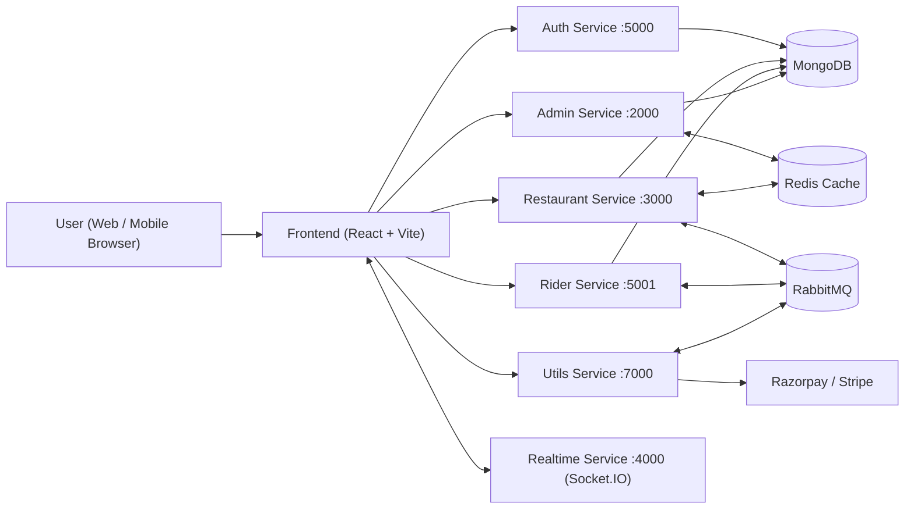
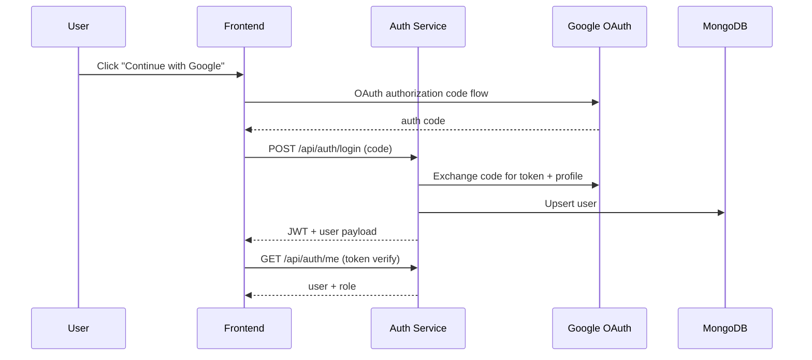
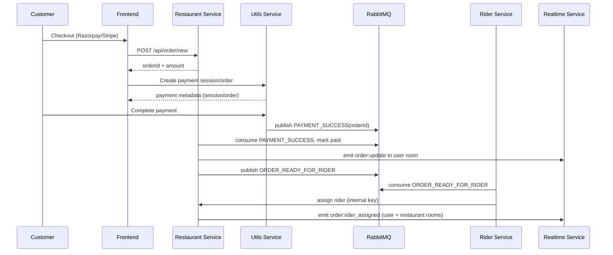
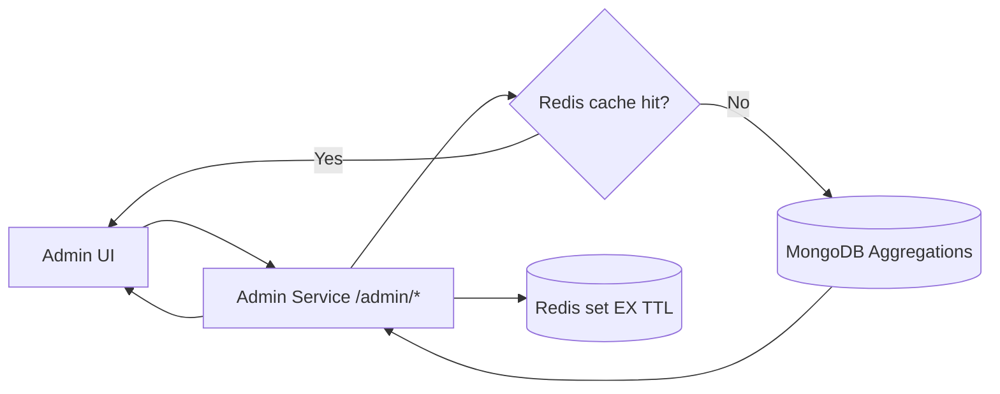
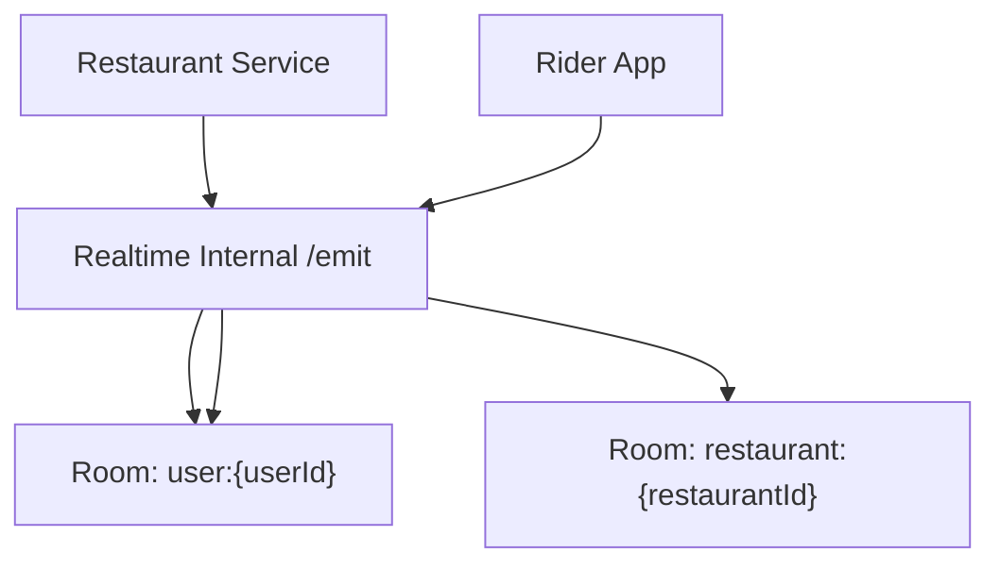

# BhookBuster System Design

This document is optimized for interview walkthroughs. It explains service boundaries, request flow, async events, and runtime behavior.

## 1) High-Level Architecture

## 2) Auth + Role Bootstrap Flow

## 3) Order Lifecycle + Async Events

## 4) Admin Analytics Flow

## 5) Realtime Delivery Flow

## 6) Service Responsibilities

- Auth service: OAuth token exchange, JWT issuance, profile/role verification.
- Restaurant service: catalog, cart, order creation, order status, rider-assignment integration.
- Rider service: rider profile, availability, accepting orders, delivery status transition.
- Admin service: pending approvals + analytics APIs + cache-backed insights.
- Utils service: cloud upload, payment providers, payment verification events.
- Realtime service: room-based socket event fan-out.

## 7) Data and Consistency Notes

- Primary persistence: MongoDB collections per domain.
- Event consistency: payment and rider flows are eventually consistent via RabbitMQ.
- Cache consistency: TTL-based, with DB fallback when cache miss or Redis unavailable.
- Security boundary: internal service calls validated with `x-internal-key`.

## 8) Scale and Reliability Improvements (Roadmap)

1. Add API gateway + service discovery.
2. Add retries, dead-letter queues, and idempotency keys for payment/event consumers.
3. Add observability: metrics, tracing, centralized logs, and alerting.
4. Introduce read models for analytics-heavy APIs.
5. Add contract tests between services for safer evolution.
